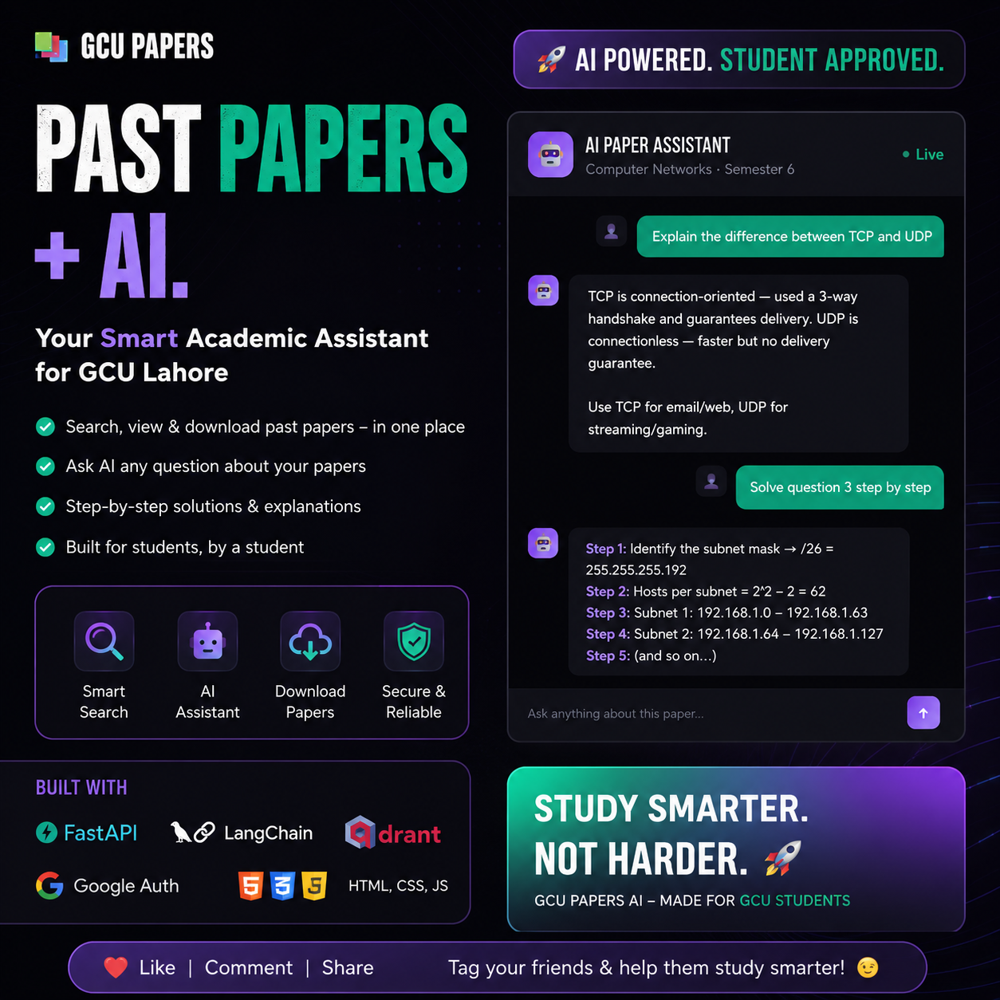

[](https://gculpapersai.vercel.app)
# GCUL Papers AI 📚🚀

An elegant, high-performance web portal tailored for GCU Lahore Computer Science and IT students to index, preview, download, and crowdsource university past papers. Built with ultra-lightweight vanilla JavaScript, asynchronous API integrations, dynamic state caching, and a responsive glassmorphic UI layout.

---

## ✨ Features & Architecture Highlights

* 🏎️ **Zero-Framework Frontend Performance:** Built entirely with native Web APIs and optimized modern CSS, achieving exceptional Core Web Vitals and lightning-fast load times.
* 🔐 **Secure Google OAuth Workflow:** Full client-server handshake verification passing credentials dynamically to a high-speed FastAPI authentication endpoint.
* 📦 **Persistent Caching:** User sessions and dark/light system choices persist across browser reloads using structural `localStorage` tokens.
* 🔍 **Multi-Dimensional Instant Filtering:** Real-time client-side array search and intersection filters across subject tokens, academic years, course departments, and active semesters.
* 📄 **In-Browser PDF Previews:** Native iframe streaming backed safely by Mozilla's hosted `PDF.js` rendering framework.
* 📈 **Dynamic Metrics Profiling:** On-the-fly analytical count updates reporting the precise depth of indexed contents, fields, and unique semesters.

---

## 🛠️ The Technology Stack

* **Frontend:** Vanilla JavaScript (ES6+ App State Engines), HTML5 Semantic Layers, CSS3 Custom Properties (Variables)
* **Backend Gateway:** FastAPI (Asynchronous Python REST API endpoints)
* **Authentication Platform:** Google Identity Services SDK API
* **Cloud Infrastructure:** Vercel (Production Web Hosting CDN Architecture)

---

## 📂 Project Component Architecture

The frontend follows a decoupling pattern where responsibilities are separated neatly across structural configuration files:

```directory
gcul-papers-frontend/
├── config.js       # Global configuration schema (Dev vs Production toggle)
├── auth.js         # Google login token listeners and session persistence state
├── upload.js       # Multi-part FormData uploads, validations, and backdrop overlays
├── script.js       # Main runtime app loop: API fetching, pagination, and filter matrices
├── style.css       # Modular variables engine (Responsive grids and light-mode tokens)
└── index.html      # Accessible UI shell utilizing premium font integrations

```

---

## 🚀 Step-by-Step Installation & Setup

### 1. Clone the Source Container

```bash
git clone https://github.com/AsadullahShehbaz/GCUL-Papers.git
cd GCUL-Papers

```

### 2. Configure Your Environment Variables

Open `config.js` and edit your API routing configurations to point to your development server or final cloud instance:

```javascript
const CONFIG = {
  // Toggle between your local FastAPI development port or your live production domain
  API_URL: "http://localhost:8000", // e.g., "https://your-backend.render.com"

  // Insert your Google API Cloud Platform client credentials here
  GOOGLE_CLIENT_ID: "YOUR_GOOGLE_CLIENT_ID.apps.googleusercontent.com",

  pdfViewer: (url) =>
    `https://mozilla.github.io/pdf.js/web/viewer.html?file=${encodeURIComponent(url)}`,
};

```

### 3. Local Execution Engine

Since the frontend uses modern modular workflows, serve your files from a clean local loop to prevent CORS issues with local file lookups:

**Using Python:**

```bash
python3 -m http.server 5500

```

**Using Node/NPM:**

```bash
npx serve .

```

Open `http://localhost:5500` inside your browser to view the system.

---

## ⚙️ Core Modules Breakdown

### 🔄 Multi-part Upload Stream (`upload.js`)

Handles raw boundary-packaged files safely without manually rewriting header contents. It converts standard input fields seamlessly into backend-compatible payloads:

```javascript
const formData = new FormData();
formData.append("file", file);
formData.append("uploaded_by", user.email);

```

### 🎯 State-Driven Filter Engine (`script.js`)

Prevents unnecessary server hits by downloading a master data list on initialization, then executing localized data filtration pipelines instantly:

```javascript
const result = allPapers.filter(p => {
  const matchText = p.subject.toLowerCase().includes(query);
  const matchSem  = !sem  || p.semester.toString() === sem;
  return matchText && matchSem;
});

```

---

## 🤝 Contributing

Contributions are vital to maintaining academic accuracy for the campus community!

1. **Fork** this repository.
2. Create a clean feature-specific workspace branch (`git checkout -b feature/AmazingUIUpdate`).
3. Commit optimizations (`git commit -m 'Fixed form alignment issues in safari browsers'`).
4. **Push** revisions up to the origin path (`git push origin feature/AmazingUIUpdate`).
5. File a structured **Pull Request** detailing changes.

---

## 📜 License

Distributed safely under the MIT Open Source License. See `LICENSE` inside the repository structure for deeper declarations.
